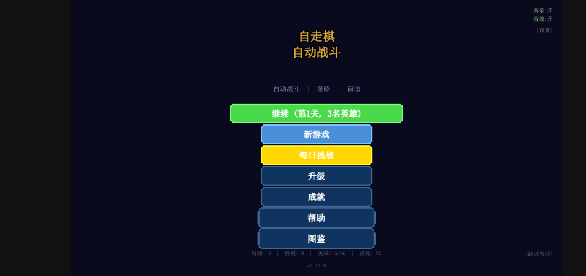
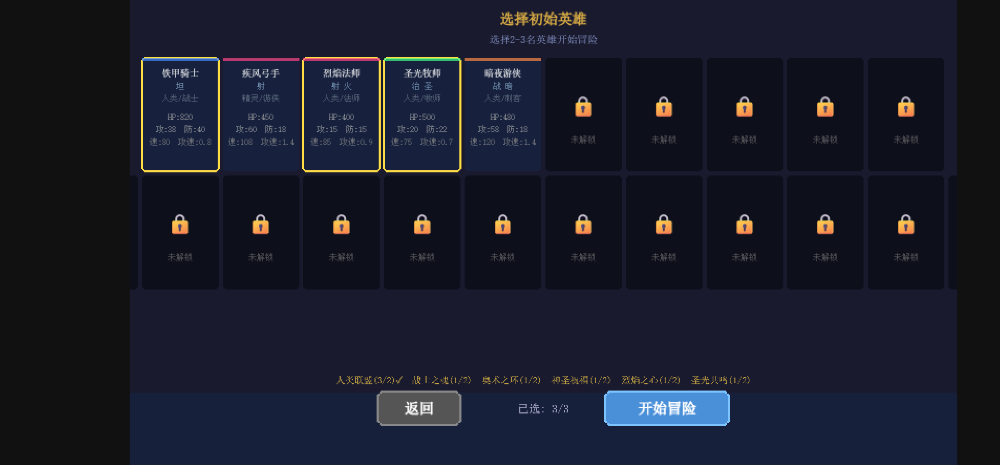
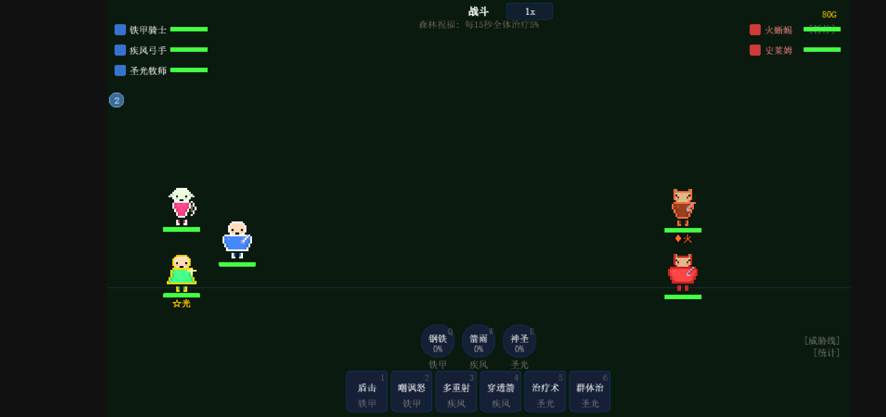
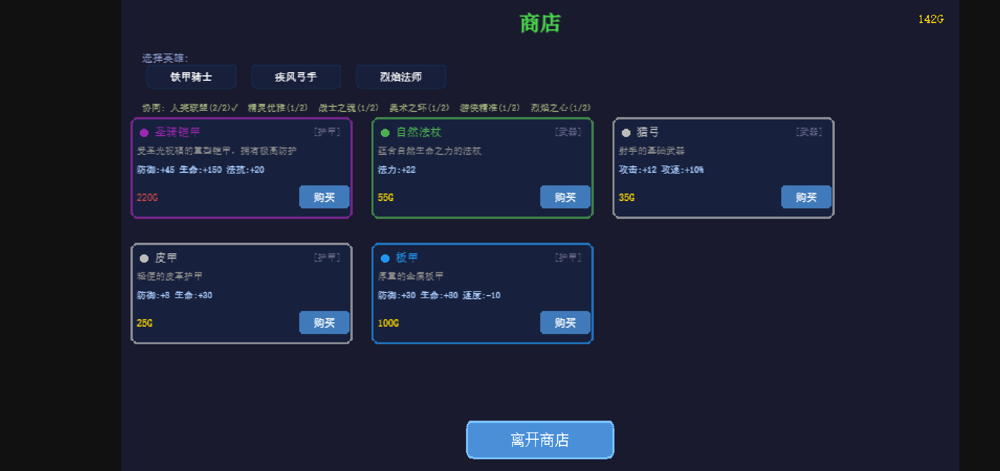
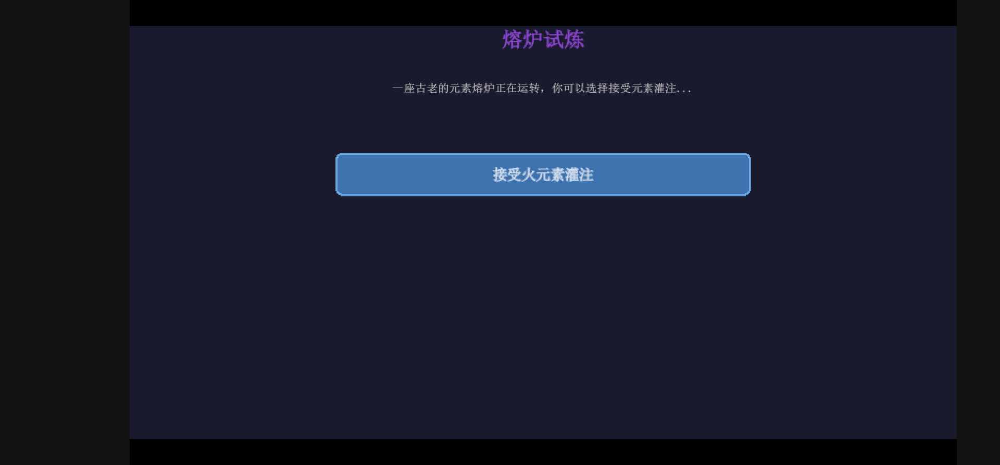

# Roguelike Auto-Battler

一款基于 Phaser 3 的 Roguelike 自动战斗游戏，融合了肉鸽地图探索、英雄养成和策略战斗元素。

**在线试玩：** [https://andsgo.github.io/roguelike/](https://andsgo.github.io/roguelike/)

## 游戏截图

### 主菜单


### 英雄选择
选择 2-3 名英雄组建队伍，解锁更多英雄需要达成特定成就。


### 冒险地图
类似《杀戮尖塔》的分支路径地图，包含战斗、商店、事件、休息等节点。


### 自动战斗
英雄自动移动和攻击，玩家通过技能栏手动释放技能，支持元素反应和连锁系统。


### 商店
购买装备强化英雄，装备分为武器、护甲、饰品等多种类型。


### 随机事件
冒险途中遇到各种随机事件，不同选择带来不同的风险与收益。


## 游戏特色

- **19 名英雄** — 坦克、近战、远程、治疗、辅助五大职业
- **5 元素系统** — 火/冰/雷/暗/圣，元素克制 + 4 种元素反应
- **6 种族 + 6 职业羁绊** — 达到阈值触发团队增益
- **46 种技能** — 每个英雄拥有独特技能组合
- **48 件装备 + 35 个遗物** — 丰富的 Build 搭配
- **34 个随机事件** — 高风险高回报的策略抉择
- **3 幕章节** — 魔法森林 → 熔岩洞穴 → 暗影要塞
- **4 难度等级** — 普通/困难/噩梦/地狱，逐步解锁
- **成就系统** — 25 个成就 + 英雄解锁条件
- **存档系统** — 3 个存档槽位 + 自动存档

## 技术栈

- **TypeScript** + **Phaser 3** — 游戏引擎
- **Vite** — 构建工具，支持代码分割
- **Vitest** — 测试框架 (500+ 测试用例)
- 纯 Phaser Canvas 渲染，无 DOM UI

## 本地开发

```bash
# 安装依赖
npm install

# 启动开发服务器
npm run dev

# 构建生产版本
npm run build

# 运行测试
npm test
```

## 项目结构

```
src/
├── scenes/       # 12 个游戏场景
├── systems/      # 23 个游戏系统 (战斗/伤害/技能/元素/羁绊等)
├── entities/     # 单位实体 (Unit/Hero/Enemy)
├── managers/     # 管理器 (Run/Save/Meta/Stats/Achievement)
├── ui/           # UI 组件 (Panel/Button/HeroCard/HUD等)
├── data/         # JSON 游戏数据
├── config/       # 平衡性/元素/羁绊/难度配置
├── components/   # 血条/伤害数字组件
├── utils/        # 工具函数 (种子随机数等)
└── i18n.ts       # 中文本地化
```

## License

MIT
