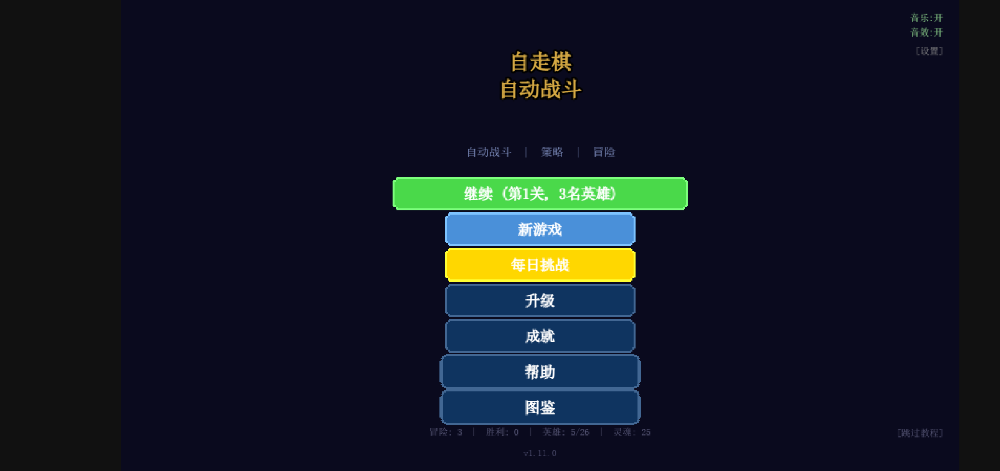
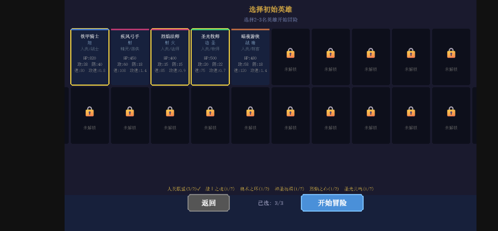
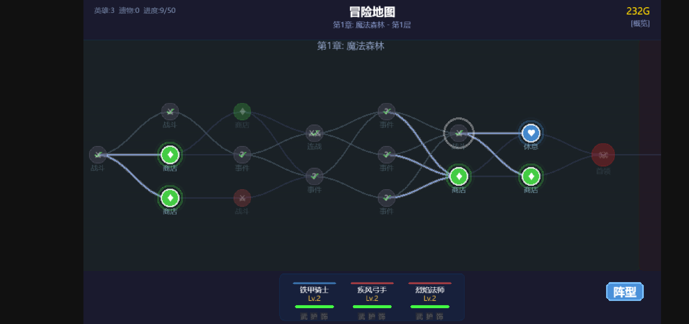
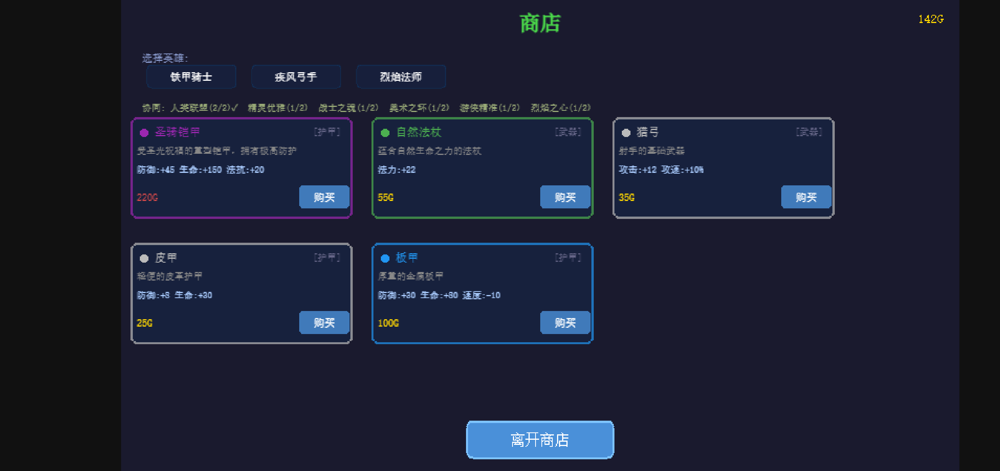
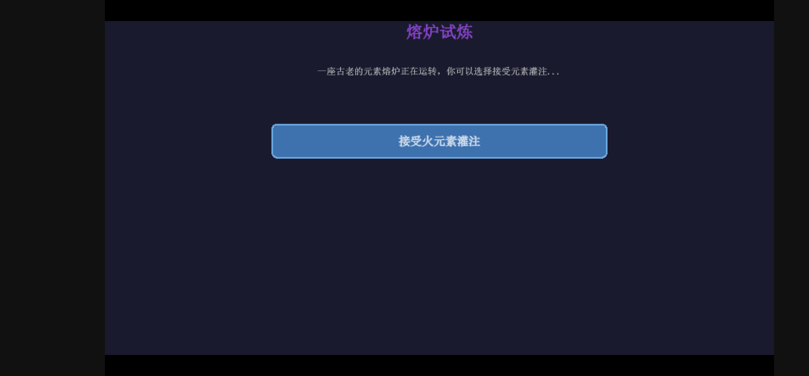
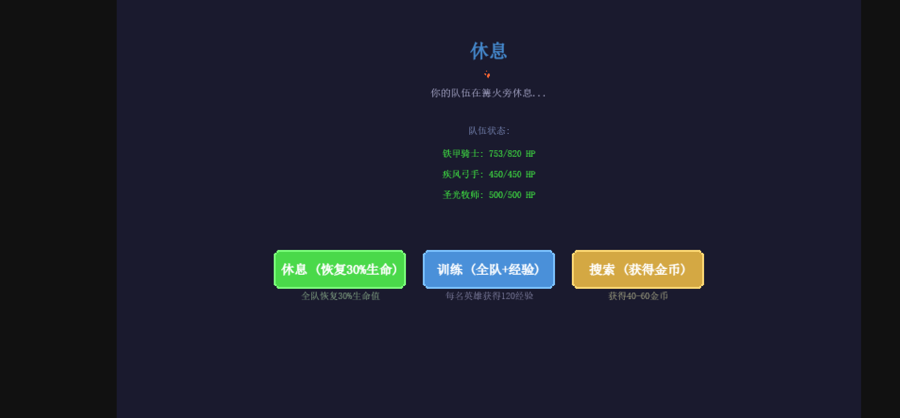
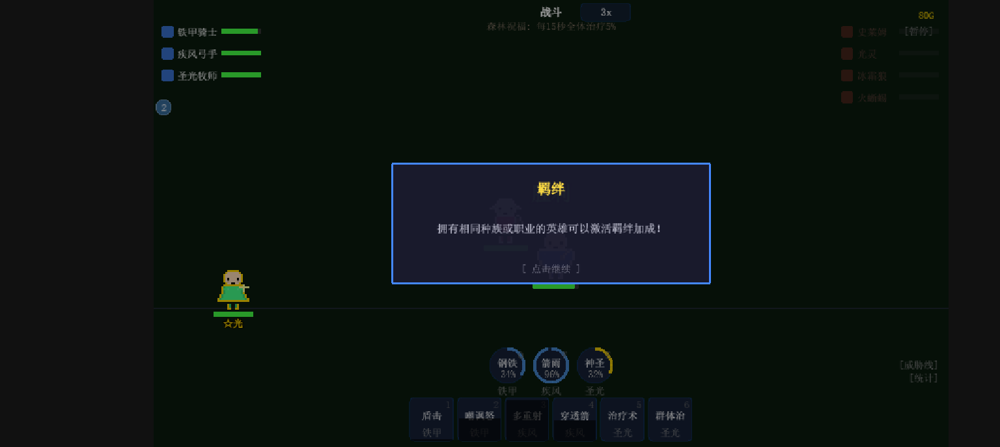
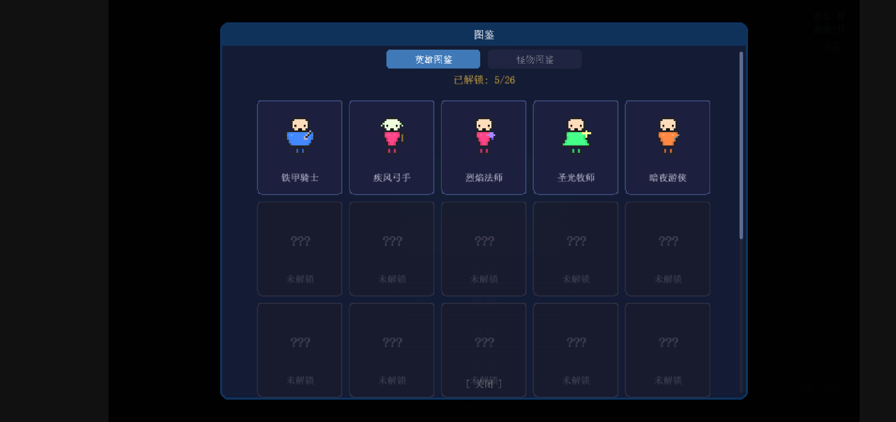
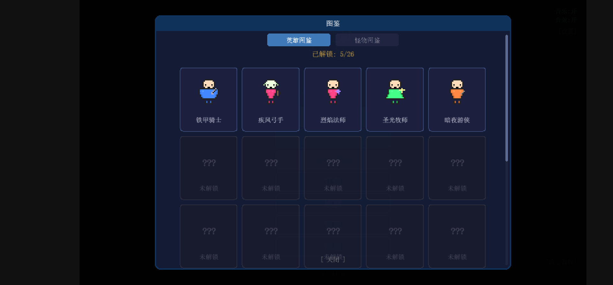

# Roguelike Auto-Battler

一款基于 Phaser 3 的 Roguelike 自动战斗游戏，融合了肉鸽地图探索、英雄养成和策略战斗元素。

**在线试玩：** [https://andsgo.github.io/roguelike/](https://andsgo.github.io/roguelike/)

## 游戏截图

### 主菜单


### 英雄选择
选择 2-3 名英雄组建队伍，实时羁绊预览帮助策略搭配。


### 冒险地图
类似《杀戮尖塔》的分支路径地图，包含战斗、商店、事件、休息等节点。支持捷径和隐藏节点。


### 商店
购买装备强化英雄，装备分为武器、护甲、饰品等多种类型，支持属性对比。


### 随机事件
冒险途中遇到各种随机事件，不同选择带来不同的风险与收益。


### 休息节点
在篝火旁选择休息（恢复HP）、训练（获得经验）或搜索（获得金币）。


### 战斗结算
战斗胜利后获得金币和经验奖励，查看队伍状态和战斗统计。


### 英雄图鉴
收集并浏览所有英雄，查看详细属性和技能信息。解锁更多英雄需要达成特定成就。


### 怪物图鉴
在战斗中遇见的怪物会自动记录到图鉴中，逐步揭开所有怪物的面纱。


## 游戏特色

- **像素风 Chibi 角色** — 16×20 像素矩阵分层渲染，按职业/种族/职业自动组合
- **26 名英雄** — 坦克、近战、远程、治疗、辅助五大职能
- **5 元素系统** — 火/冰/雷/暗/圣，元素克制 + 4 种元素反应
- **6 种族 + 6 职业 + 5 元素羁绊** — 达到阈值触发团队增益
- **92 种技能** — 每个英雄拥有独特技能组合 + 终极技能
- **52 件装备 + 48 个遗物** — 丰富的 Build 搭配
- **49 个随机事件** — 高风险高回报的策略抉择
- **28 种敌人** — 包含 5 个 Boss，4 个 Boss 支持阶段性机制
- **4 幕章节** — 魔法森林 → 火山荒原 → 深渊 → 元素熔炉
- **4 难度等级** — 普通/困难/噩梦/地狱，逐步解锁
- **每日挑战** — 全球同步种子 + 7 种规则修饰 + 模拟排行榜
- **图鉴系统** — 英雄图鉴 + 怪物图鉴，遇见即解锁
- **成就系统** — 25 个成就 + 英雄解锁条件
- **存档系统** — 3 个存档槽位 + 自动存档
- **地图变体** — 捷径跳层 + 隐藏节点（花费金币揭示）
- **选人羁绊预览** — 英雄选择界面实时显示羁绊搭配
- **文字清晰度优化** — TextFactory 系统 (resolution:2 + LINEAR 滤镜)
- **Boss 阶段系统** — Boss 血量阈值触发召唤增援和强化效果

## 技术栈

- **TypeScript** + **Phaser 3** — 游戏引擎
- **Vite** — 构建工具，支持代码分割
- **Vitest** — 测试框架 (977 测试用例, 77 套件)
- 纯 Phaser Canvas 渲染，无 DOM UI
- 像素矩阵 Chibi 渲染系统 (分层模板 + 调色板映射)
- TextFactory 文字预设系统 (6 种预设 + resolution:2 + LINEAR 滤镜)

## 本地开发

```bash
# 安装依赖
npm install

# 启动开发服务器
npm run dev

# 构建生产版本
npm run build

# 运行测试
npm test
```

## 项目结构

```
src/
├── scenes/       # 12 个游戏场景
├── systems/      # 28 个游戏系统 (战斗/伤害/技能/元素/羁绊/渲染/Boss阶段等)
├── entities/     # 单位实体 (Unit/Hero/Enemy)
├── managers/     # 管理器 (Run/Save/Meta/Stats/Achievement/DailyChallenge)
├── ui/           # UI 组件 (Panel/Button/HeroCard/HUD/Codex/TextFactory等)
├── data/         # 游戏数据 (英雄/敌人/技能/像素模板等)
├── config/       # 平衡性/元素/羁绊/难度配置
├── components/   # 血条/伤害数字组件
├── utils/        # 工具函数 (种子随机数/羁绊计算/地图工具等)
└── i18n.ts       # 中文本地化
```

## 版本历史

| 版本 | 主要内容 |
|------|---------|
| v1.16.0 | 每日挑战增强：规则预览、7种修饰、视觉指示、模拟排行榜 |
| v1.15.0 | 视觉打磨：TextFactory文字系统、治疗闪光、武器模板、状态提示、平衡调整 |
| v1.14.0 | 深度提升：选人羁绊预览、地图捷径和隐藏节点 |
| v1.13.0 | 内容补充：3新英雄、12新事件、3Boss阶段、休息多选 |
| v1.12.1 | 平衡补丁：元素倍率、羁绊增强、敌人技能、反击光环 |
| v1.12.0 | 紧急修复：数值平衡、防御上限、教程激活、重试按钮 |
| v1.11.0 | 第四幕：元素熔炉 (4英雄+7敌人+Boss阶段系统) |
| v1.10.0 | 战斗突变系统 |
| v1.9.0 | 多波次连战节点 |
| v1.8.0 | 前后排阵型系统 |

## License

MIT
